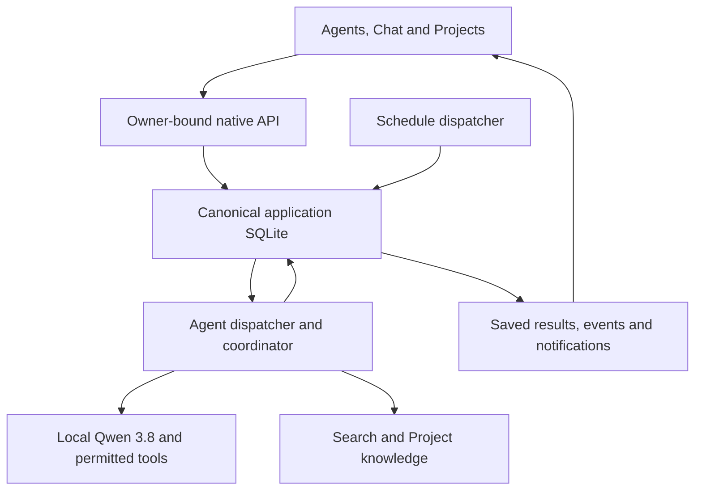

# Audrey agent workspace, search, project knowledge and monitoring

**Status:** In progress, November 1, 2026. Public-research Agents, unified lexical
Search, Project Knowledge and public-page Watches with Project links are implemented locally. The owner confirms Search
returned expected matches; full acceptance remains pending. Campaigns 1–4 remain closed.

The owner selected unified search, saved background tasks, project working
memory and scheduled monitoring. Background tasks mean a visible agentic
architecture: Agents should be a prominent part of Audrey's native UI.
Backups and disaster recovery are outside this plan. Agent restart recovery is
part of the requested background execution capability.

## Current implementation slice

The native app has centered Chat, Agents and text-only Search buttons in the top
bar. Search toggles a right sidebar with its own
query, filters, results and source reader, while preserving the active workspace
and drafts. The panel shares Chat's 17rem (272px) sidebar width. At 1,280 pixels and above Search
is docked beside the workspace; smaller screens use an accessible overlay drawer.
Two small right-pointing chevrons collapse the panel. Collapse retains search
state, aborts hidden reads and revalidates the saved query
on reopening. Source text opens inside the panel with paging and Back to results;
Project Knowledge's separate source previews retain their modal behavior.
It has a saved public-source
research workflow: Plan, Research and Review. Users can create tasks, inspect
saved step results/reports, pause/resume/cancel, rerun the same agent and delete
terminal history. Run again preserves completed checkpoints on unfinished tasks;
completed tasks repeat Research/Review using the saved Plan. The agent ID and
selection stay the same. Lists return compact summaries and load the selected report separately.
Agents has a left sidebar for creation, history and active controls; its workflow
and sidebar scroll independently. Small screens use a controls drawer. Terminal
Run again and the red two-click Delete remain at the workflow card's top right.
Top-bar hover uses the filled, soft glow of My Files, with distinct keyboard focus
retained. Agent headings/history use a saved
short title, and the unchanged original objective is available in an expandable
Original prompt section.

Application schema 26 introduced owner-bound tasks and operation reservations with
leases, fenced writes and cumulative limits. The lifecycle worker reuses committed
steps after interruption; uncommitted model/read work can repeat within the saved
allowance. Every provider/tool dispatch revalidates live task/account/model access.
Public agents offer only web search/fetch; automatic personal-memory recall and
file/write tools are excluded. Every model step uses only verified local
`qwen3.8:latest`, with no classifier, cloud panel or fallback. The worker verifies
installed local weights before generation and pins their digest within each step;
missing or changed metadata stops execution. Public web tools still fetch source
material. Model calls share existing admission and generation limits. Account
purge removes the new task data and receipts.
Schema 28 adds persistent agent titles. One bounded local Qwen title call runs
before the first incomplete step, using the same verified client, model admission,
lease and cumulative operation allowance. A failed title leaves a short fallback
and does not block research. Rerun keeps a generated title; untitled legacy agents
receive a generation attempt on their next explicitly started run. The title call
has a 64-token allowance, thinking disabled and a ten-second timeout; it uses no
cloud fallback and does not alter the objective or saved Plan.

Model failures identify the actual stage and distinguish output limits from empty
report text. Per-call logs retain only stop/usage counts and text lengths;
report and reasoning bodies are excluded. Truncated tool calls stop before dispatch.
Research and Review allow up to 8,192 generated tokens per call, including model
reasoning. Plan has a separate 2,048-token cap, bounded by the overall call limit.
This raises the original 2,048-token report allowance after a reported Research
output-limit failure; live acceptance of the larger allowance remains pending.

This slice uses a fixed three-stage workflow and the existing bounded ReAct loop.
Adaptive multi-step plans, source-backed Project notes, file/Private agent inputs,
semantic search,
owned-file/Private and multiple-source watches remain implementation work. Existing Private Tax tasks keep
their current behavior. The remaining sections specify the intended full feature.

The first unified Search slice searches native completed/incomplete user and
assistant message bodies, saved agent reports and locally readable file text.
Supported file sources include documents, generated output text, cached image OCR,
media transcripts, generated visual notes and summaries. Existing retained text
works when original bytes are missing; Search labels that state explicitly.
Private files use their saved local text without model or remote processing.

Search has source, Project, chat archive and inclusive UTC update-date filters.
Results contain canonical IDs/revisions, plain-text snippets and Unicode character
highlights. Opening a match reads a fresh bounded text window from the canonical
message, report or file artifact; it does not infer PDF pages or media timestamps.
The viewer pages through that source and rejects deleted or changed revisions.

A dedicated local SQLite FTS5 projection uses bounded owner-scoped backfill and
periodic reconciliation. Unchanged sources avoid index rewrites; ownership,
deletion, Project membership and source/stat pins are checked after awaited reads
and immediately before returning text. Account purge clears projected text, and
pagination is bound to owner, query, filters and index generation. Search uses no
models, embeddings, sidecar history/memory or cloud calls. Unsupported/oversized
sources and incomplete backfill produce an explicit partial-results state.
Coverage notices now count genuine unreadable/oversized sources within the selected
filters, exclude unfinished/failed uploads, and avoid duplicate generic warnings.
Indexing has its own status; multiple coverage details can be expanded.
Current bounds include 256 query characters/12 literal terms, 500,000 characters
per source, 5,000 sources/10 million source characters per owner, and the first
200 matching source candidates per query. File input/expanded parsing is bounded
to 8 MiB; existing cached text can cover larger originals. Approved Project notes
are now searchable, with source-review labels when references become stale. Semantic
candidates remain later work. Canonical source previews now link into their owned
conversation, file, agent or Project workspace, as described below.
Local tests and mocked responsive browser checks verify mechanics;
real deployed file/content acceptance remains manual.
The Search sidebar's affected tests, production build and mocked browser checks at
1,440, 1,100, 768, 390 and 320 pixels pass, including focus, independent scrolling,
source revisions and retained drafts. The Search layout alone needs only the UI rebuild.

Project Knowledge now stores user-authored Facts, Decisions, Questions and Actions
in application schema 27, with immutable revisions, pinning, open/completed/resolved
states and optimistic concurrency. Project home supports editing, history, explicit
approval/rejection and deletion. A completed Agent report can open a proposal editor:
the user chooses the statement and Project; saving creates a pending report-linked
proposal. It does not generate statements or approve them automatically. Replacement
approval checks the original revision and supersedes it atomically. Approval records
what the user accepts, rather than independent verification.

Native Project conversations select bounded approved notes (at most 12 entries and
1,000 content tokens within the existing 3,000-token Project source allowance), with
pinned/relevant/open-work priority. Notes are quoted data below platform guidance;
pending, rejected, superseded and stale-source entries cannot ground a new run.
Each native run saves only its selected entry IDs/revisions; generation rechecks the
frozen knowledge/source proofs and fails if they change. Private Project chat stays
inside its existing verified local policy. Public background Agents still have no
file or Private inputs, and saved Private Tax tasks keep their established context/admission.

Source references contain canonical IDs/revisions only, with Project-scoped source
previews and local ownership/deletion/detachment checks. Explicit user notes and
report-linked user proposals retain their bodies with a source-review notice when
references disappear, while automatic grounding excludes them. Automatically extracted
source-derived notes, public-source snapshot references, automatic agent proposals,
and a full source-reference editor are later work. Entry/Project deletion and account
purge erase the new rows/history/manifests and invalidate/remove search copies.
Limits are 200 entries per Project, 8,000 characters per entry, eight references and
100 revisions per entry. No knowledge model calls, global-memory writes or cloud
summaries were added. Local tests and mocked browser flows pass; real-model reuse
and deployed acceptance remain manual.

Public-page Watches now appear beside Tasks and Activity inside Agents. Creating a
watch explicitly saves one public HTTP(S) URL, a criterion and a previewed interval,
daily or weekly schedule in an IANA timezone. Query parameters, URL credentials,
fragments, nonstandard ports and local destinations are excluded. Saving schedules
the first future check; Run now is separate and can check a paused watch without
resuming its schedule. A fresh deployment has no watch definitions and starts no page checks.

Schema 29 stores watch definitions, immutable run inputs/source snapshots, baselines,
operation receipts and in-app notices. The scheduler coalesces missed occurrences,
runs repeated DST times once and moves nonexistent wall clocks to the first valid
minute. Leases, revision fences, cumulative allowances and capped retry/backoff cover
restarts; research agents and watches share the one-active-task-per-owner boundary.
Pause/edit/delete revoke earlier work. Owner purge removes all new derivatives.

The guarded fetcher authorizes every network hop and rejects incomplete/oversized
responses. Versioned deterministic extraction establishes the first baseline and
skips model calls for unchanged text. Changed text has exact Unicode-offset evidence
and a separate bounded significance assessment by verified local Qwen, without tools
or cloud fallback. Failed fetches, extraction, comparison or model assessment retain
the last valid baseline. The current bounds are 256 KiB downloaded, 64,000 UTF-8 bytes
of normalized text, and 16,000 bytes of complete changed-span evidence; larger work
fails visibly rather than silently truncating a comparison. Compatible criterion and
cadence edits retain the baseline; URL/redirect identity or extraction changes rebaseline.
History exposes each run's saved URL, criterion and schedule separately from the
current definition. Significant changes and persistent failures create deduplicated in-app Activity
notices linked to the exact saved check. Unchanged checks remain in history. There
are no external notifications. Owned-file/Private watches,
multiple-source definitions remain later work.
Affected hermetic checks and mocked desktop/phone browser flows pass; real public
page changes, scheduled runtime and model-judgment acceptance remain manual.

Schema 30 unifies agent completion/failure notices and existing watch alerts in
Agents' Activity inbox. Terminal agent state and its deduplicated notice commit
together; retries, pauses and cancellations remain silent. Notices contain a
bounded display title and fixed status text, without copying reports or provider
errors. Agent targets bind the task ID and current terminal revision; watch targets
bind the owned watch and exact retained run. Resolving an item validates its target
before marking it read and opening the existing task/check, preserving drafts.
Run again removes the previous agent notice atomically because it replaces the saved
report; this adds no report history or backfill for already terminal tasks.

The inbox lists up to 50 current items, unread first, with a full count across both
origins. Older unread items surface as newer ones are read. Badge polling fetches
counts only; hidden reads abort and polling/read acknowledgments are fenced against
stale UI updates. Owner, target, revision and deletion checks also run after awaited
reads. Task/account deletion cascades notices; existing watch retention and legacy
watch-only notification routes remain intact. This slice adds no model calls or
external delivery. Affected storage/API/UI tests, lint, production build and mocked
desktop/phone browser flows pass; deployed acceptance remains manual. Rebuild both
backend and UI for this slice; the backend applies schema 30 automatically.

Schema 31 adds durable planning questions. The same verified local planning call
can return one bounded question when an essential detail cannot reasonably be
inferred. A complete, validated request saves the question, releases the lease and
compute, and exposes Waiting for input plus a deduplicated Activity notice. No
Research or Review starts while it waits. The stored task remains paused internally;
the public waiting state comes from its pending question, avoiding a task-table
rewrite. Waiting time does not consume active execution allowance.

The owner answers inside the existing agent card. The answer transaction checks
question identity, current task revision, owner access, remaining cumulative limits
and queue capacity before queuing that same task. Dispatch revalidates model/tool
authority. Questions and answers survive restart, are supplied to subsequent steps,
and remain visible as saved history. Summary polls omit their bodies while retaining
the waiting state; the selected task loads them separately. Drafts survive tab/task
changes, and a changed revision requires review before using a retained draft.
Activity opens the exact waiting task and cannot reopen an answered/cancelled request.

This slice supports planning questions only, with at most three per task lifetime,
2,000 UTF-8 bytes per question and 8,000 per answer. It preserves original objectives,
completed Plans and all operation/attempt/time usage. Pending questions require an
answer or Cancel; generic Resume cannot bypass them. Run again after cancellation
dismisses an unanswered question and retains answered history. Task/account deletion
erases these records. Strict output/answer validation, idempotent queued-answer retries,
post-await ownership/deletion/revision fences and plain-text rendering cover stale or
invalid requests. No extra classifier, cloud model, external delivery or additional
tool authority was added. Rebuild backend and UI; schema 31 applies automatically.

Schema 32 links public-research agents to ordinary Projects. The composer offers
an optional Project, and Project home lists its saved agents plus an explicit
New agent in Project action. Prefill preserves the objective and requires Start
agent. Saved task and Project links resolve current owned targets before navigating;
hidden or superseded reads abort, while mounted conversation and agent drafts stay intact.

Creation freezes up to 2,000 tokens of Project instructions and 1,000 text tokens
across at most 12 approved notes without source references. Selection prioritizes
pinned, relevant and open work; newly added notes are not silently adopted. Source-backed
notes, file contents and Private Projects remain outside this public workflow.
Every step receives the selected context as quoted working data under platform
guidance. Approved notes do not verify truth or authorize new tools or actions.
All model calls remain verified local Qwen; only Research has the existing public tools.

The additive manifest stores instruction hashes and note IDs/revisions/prefix lengths,
without copying input bodies or Project names. Canonical rows supply text afresh.
Ownership, context and deletion fences cover claims, dispatch, saved steps, questions,
completion, answers, Resume and Run again. Changed selected instructions/notes block
further work and require a new explicit agent; they cannot silently replace inputs or
replan the existing agent. A rename or unrelated file/note addition does not invalidate
the task. Cancel, deletion and saved-report access remain available.

Project deletion removes canonical context and leaves saved reports with an unavailable
Project label; task/account deletion removes the manifest. Agent reports participate
in the existing Search Project filter, with canonical revision fences when their
Project disappears. Existing agents remain unscoped after migration. Affected local
storage/runtime/API/UI checks, lint, TypeScript, build and mocked desktop/phone flows
pass; real model and deployed acceptance remain manual. Rebuild backend and UI;
schema 32 applies automatically with no configuration change or required upload.

Project home now puts conversations and files in the first row, with Knowledge and
Agents side by side below. Scoped spacing, smaller controls and bounded scrolling
keep all four panels within the checked laptop viewports. The available pane width
controls stacking on narrow screens. Full instructions and long lists remain scrollable;
Knowledge editing and the existing Private Tax section remain available.

Search's saved-source reader now offers explicit Open conversation/file/agent/Project
actions after a successful canonical read. Navigation reads the owned target and then
rechecks the original source revision and exact target identity. Deleted, detached or
replaced sources clear the displayed source and leave the reader open with an error.
Transient navigation failures retain the source for retry. Collapse, Back, owner reset and
superseding navigation abort pending links and ignore late replies.

Conversation links select and focus the matching saved message, including archived
Private conversations, while preserving mounted drafts and running threads. Retained empty
conversation drafts remain reachable from a compact Draft conversations list. Agent links
open the existing task without creating or rerunning it. File links select the current
owned file and supported matching text/artifact tab in My Files. Image OCR and retained
document text remain readable in Search when their native preview/original is unavailable;
this slice does not add missing bytes or expand file-reading endpoints. Knowledge links
open their owned Project. Search queries/filters and agent objectives survive navigation.
Local UI tests, lint, TypeScript/build and mocked laptop/phone browser checks pass;
deployed acceptance remains manual. This slice needs only an audrey-ui rebuild, with
no schema/configuration change or upload.

Shared local-model admission now distinguishes interactive work from Agent/Watch
generations. Interactive requests precede unaged background work in both the
per-user cap and GPU queue. Eligible GPU waiters retain per-user round robin;
older background work joins the interactive tier after the configured aging
threshold. Running generations finish without interruption, and cloud GPU bypass
and existing total concurrency caps remain unchanged.

Agent titles, Plan, each Research model call, Review and Watch significance checks
use the background path. Public tool reads hold neither queue. A background call
waiting for GPU can give its per-user permit back to later chat, including when
the per-user cap is one. Handoffs retain the original queue age, preventing chat
traffic from continually restarting the aging clock. Admission remains per-user
then GPU; cancellation returns queued or just-granted resources, and provider work
and its authority/usage scope stay in the original task. Title operations are
reserved after admission, avoiding charges for titles cancelled while queued.

The shared `fairness.background_aging_seconds` setting defaults to 30 seconds and
accepts positive finite numbers up to 300. It is a priority threshold, not a
completion deadline: occupied generations and earlier eligible work still finish.
Workload/stage wait histograms and aggregate GPU workload/aging counts expose
queue pressure without owner IDs or content in metric labels. Dispatch still
revalidates account/model/Project/lease authority after waiting; only verified
local Qwen is available to agents, with no new model or cloud fallback.
Affected hermetic transport, queue, cancellation, lifecycle/configuration and
readiness checks pass; live concurrent-chat/model acceptance remains manual.
Rebuild and recreate audrey for the configuration addition. No schema migration
or upload is required.

The admission slice now has a short reusable installed-backend smoke. The Tower
wrapper streams it into the running container, imports the installed scheduling
code and reads the bound configuration. Five isolated cases check configured
capacity, cap-one chat priority, synthetic GPU-age promotion, running-call completion
and cancellation cleanup, with bounded waits and explicit exit codes. It needs no
credentials, accounts, model calls or network access. The runner and negative
failure detection pass locally; the deployed invocation is documented in
[live testing](../reference/live-smoke-testing.md#installed-admission-smoke).
The owner reported a Tower pass for all five cases with exit 0: configured GPU
capacity 1, per-user capacity 3 and background aging 30 seconds. Real GPU/HTTP
contention acceptance remains unrun.

### Project public-page watches

Schema 33 optionally associates a public-page Watch with an owned ordinary Project.
Project home lists its watches in a compact row below Knowledge/Agents. New watch
in Project opens the existing Watch composer with only the Project preselected;
the user still previews the schedule and presses Create watch. Existing links open
the same Watch even before its first check. Current definitions and saved checks
offer canonical Project navigation, while chat and unfinished Watch drafts remain
reachable. Private Projects are excluded.

This association organizes the public page; Project instructions, notes and files
are not check inputs. Each check records its original Project ID in its immutable
definition; names and availability come from fresh owned Project metadata. Edits
may reassign or explicitly unlink a Watch, cancelling old queued/running work.
An organizational change retains a URL-compatible baseline. Legacy unscoped
definitions, checks and creation retries remain compatible.

Project deletion or unavailability blocks dispatch, heartbeat and result commits
immediately. The next scheduler sweep pauses linked definitions and cancels
outstanding checks. Saved history stays readable; Pause/Edit/Delete and explicit
unlink remain available. Run now/Resume require an available Project. Synchronous
checks after awaited reads fence stale metadata and the final socket boundary.

Affected backend/UI tests, migration replay, model-response deletion boundaries
and responsive mocked browser checks verify this slice locally. The paused-watch
[native smoke](../reference/live-smoke-testing.md#project-watch-api-smoke) exercises
deployed Project/Watch API wiring without page fetches or model generation; its
Tower run remains pending. Rebuild backend and UI; schema 33 applies automatically.
No configuration change or upload is required.

## Product outcome

A user can give Audrey an objective, choose its Project and sources, start an
agent, and return later to its plan, progress, questions and results. The agent
can perform bounded research and document work, check its progress against the
objective, and continue from committed steps after a backend restart.

The same workspace lets users find saved content, maintain approved Project
knowledge, and schedule recurring checks that produce meaningful change reports.
These are four connected capabilities with one execution foundation.

Example: start an agent to compare selected technical documents and produce a
cited report; find its evidence through Search; approve a proposed Project
decision; then schedule a weekly check of a selected public release page.

## Current foundations

| Area | Already present | Work required |
| --- | --- | --- |
| Native runs | Saved agent objectives, three-stage plans/checkpoints, planning questions, leases and restart dispatch | Adaptive steps and finer-grained within-step recovery |
| Resource admission | Interactive preference, aged background fairness, cooperative queued handoffs and generation-boundary release | Live concurrent-chat/model acceptance and broader checkpoint-age monitoring |
| Private tasks | Leases, revisions, source/model pins, budgets and committed-result delivery for Private tax reviews | General agent contracts and adapters; existing Private recovery currently pauses work |
| Search | Local lexical API/sidebar, canonical reader and workspace links, exact message focus, bounded projection, approved notes and Project report filters | Semantic candidates and expanded native previews for retained text |
| Projects | Compact overview with Knowledge/Agents below and a Watch row; approved knowledge in native chat and ordinary agents; fixed agent context, Project links and saved-work lists | Source-backed note and file/Private agent context, automatic proposals |
| Scheduling | Explicit public-page schedules, Project organization/navigation, snapshots/diffs, baselines and Activity alerts | Owned-file/Private and multiple-source watches |

Code anchors:

- [Native run manager](../../src/audrey/routes/app/runs.py),
  [pipeline graph](../../src/audrey/pipeline/graph.py) and
  [startup](../../src/audrey/main.py).
- [Private task repository](../../src/audrey/app_state/private_tasks.py),
  [admission](../../src/audrey/private_task_admission.py),
  [step runner](../../src/audrey/private_task_runner.py) and
  [delivery](../../src/audrey/private_reviews.py).
- [Project repository](../../src/audrey/app_state/projects.py),
  [context snapshots](../../src/audrey/project_context.py),
  [history search](../../tools-server/chat_archive.py) and
  [guarded public fetch](../../tools-server/fetch.py).

Ordinary run history is durable, but its live execution/event buffer is not a
restartable agent. The existing pipeline compiles without a durable checkpointer;
interrupted ordinary runs become terminal failures on startup. Private tasks are
specialized around Tax cases and deliberately pause on restart. Exposing their
existing routes alone would not deliver the requested architecture.

## Main UI

Add **Agents** beside Chat and Projects in primary desktop/mobile navigation.
Keep an active-work count visible without requiring an open conversation.

The Agents home has New agent task and views for Running, Needs your input,
Scheduled and Finished. Paused/failed work remains accessible with its stop reason.
Cards identify the objective, Project, current stage, last real activity and result.

Each task opens a full workspace containing:

- Objective, success criteria, selected Project/sources and processing mode.
- A visible plan with pending/running/completed steps and bounded replanning.
- Observed activity, findings, source links and produced files.
- Questions that need the user's input, with answers saved against the task.
- Pause, Resume, Cancel and Run again. Run again keeps the same agent and its
  completed Plan, continuing unfinished work or refreshing a completed report.
- Results and proposed Project knowledge updates with links to their provenance.

The visible plan explains intended work; progress reflects observed actions.
Neither is a raw model reasoning transcript. Use stage/step status rather than
invented percentage completion.

Projects gain links to their agents, schedules and Knowledge panel. Search can
open matching messages, file passages, agent results and approved knowledge.
Chat and Project actions can prefill a new task; starting it remains explicit.

## Shared execution design

```mermaid
flowchart TD
    UI[Agents, Chat and Projects] --> API[Owner-bound native API]
    API --> DB[Canonical application SQLite]
    DB --> Worker[Agent dispatcher and coordinator]
    Worker --> Pipeline[Local Qwen 3.8 and permitted tools]
    Worker --> Context[Search and Project knowledge]
    Worker --> DB
    Schedule[Schedule dispatcher] --> DB
    DB --> Results[Saved results, events and notifications]
    Results --> UI
```

Start with a lifecycle-owned dispatcher inside Audrey. It must share the existing
GPU gate, per-user admission, discovery and processing policies. The current GPU
gate is process-local; moving work to a separate worker would first require
shared admission. No new orchestration service is required for the initial scope.

One coordinator owns each objective:

`admit -> plan -> execute bounded step -> commit result -> check objective`

The next action is another step, a bounded replan, a saved user question, or a
terminal result. Existing local generation and tool capabilities perform the actual
work. Trusted code validates the proposed steps, dependencies, tools and source
scope. Agent model work is local-only, currently restricted to `qwen3.8:latest`
for planning, execution and review. Cloud models and fallback are excluded.
All child work counts against the same allowance.

### Durable state and recovery

Keep task lifecycle and user-visible state in application SQLite. Proposed
entities, finalized during the first milestone:

| Entity | Purpose |
| --- | --- |
| Agent task | Owner, objective, accepted scope, Project, privacy, sources and limits |
| Agent run | One execution/retry, context manifest, status, usage and stop reason |
| Plan/step | Versioned work plan, dependencies, input identity and committed outcome |
| Attempt/operation | Lease, fencing generation, request identity and tool/output receipt |
| Event | Ordered public activity for reconnect and saved history |
| Input request | A specific question, expected revision and saved response |
| Delivery/notification | Durable result reference, deduplication key and read/delivery state |

Use separate task status and execution stage. Statuses include queued, running,
waiting for user, paused, completed, cancelled and failed; stages describe planning,
execution and checking. Waiting/paused tasks release compute and leases.

Persist explicit step inputs, selected source/context revisions, concise progress,
operation receipts and output references. Do not serialize live coroutine objects
or claim arbitrary instruction-level resumption. Resume at supported committed
step boundaries. A new attempt can repeat uncommitted read/model work within its
remaining allowance; committed outputs must be reused.

Use atomic claims, expiring leases and monotonically increasing fencing values.
Check the fence again before committing progress, attaching an output or delivering
a result. Commit checkpoint/result references and delivery intent together where
they share the application database; use durable receipts across storage boundaries.
Replay committed delivery after restart without duplicate files/messages/notices.

Record an operation identity before dispatching effects. An uncertain external
outcome without a safe idempotency/reconciliation path pauses for review instead
of being blindly repeated. Exactly-once external execution or model billing is
not promised.

The first implementation uses an explicit step controller around existing
pipelines. Evaluate a persistent LangGraph checkpointer where it adds useful
within-step recovery, after confirming installed-version compatibility. Task
state and Project knowledge remain different authorities: LangGraph likewise
distinguishes [thread checkpoints from cross-thread stores](https://docs.langchain.com/oss/python/langgraph/persistence).

### Scope, authority and resource use

Starting a task authorizes the selected read/research and generated-output work.
Routine work inside that scope proceeds without repeated confirmations. Missing
facts create saved input requests. Expanding the objective or performing a new
consequential external action requires a concrete user decision.

Revalidate the active owner, model/tool grants, Project membership, required
sources and processing mode on claim/resume, before each model/tool dispatch or
protected source read, and before committing outputs.
Never persist browser bearer credentials. Snapshot relevant inputs for each run;
material changes require revalidation/replanning, while a Project rename does not.

Bound queued/active work per user and globally, plan steps/replans, model/tool
calls, retries, active execution time, output bytes and event retention in
`config.yaml`. Start conservatively with one active agent task per user. Account
for all attempts and child calls; resume and Run again do not reset usage.
Reruns check current queue capacity and remaining saved allowances before changing
the task. Reserve resources
before dispatch and conservatively retain charges for unknown outcomes after a
crash until reconciled. User waiting time does not consume active execution allowance.

Extend existing admission to distinguish interactive and background calls, with
aging so neither is starved. Yield at model/step boundaries; do not interrupt an
active GPU generation to implement priority. Track queue wait, checkpoint age,
stops and retries through existing monitoring without private-content labels.

Private processing inherits canonical restrictions. Public web research/watches
are unavailable in Private mode; supported local source work can be enabled only
through verified local adapters. Keep the existing Private Tax task path intact
initially, then expose it through an Agents adapter once its behavior is preserved.

## Unified content search

Build a native Search view and an authenticated `/api/search` service. Derive
ownership from the principal; requests can filter source kind, Project, date and
archive state, but cannot select another user's namespace.

Return typed source IDs, source revision, title, matching excerpt/highlight ranges,
availability and an exact supported navigation target. Search messages and file
contents rather than only titles/filenames. Add agent results and approved Project
knowledge as those entities ship.

Use a dedicated, rebuildable local SQLite search projection for lexical content,
with bounded incremental indexing/backfill. Keep canonical application messages,
upload catalog records and retained artifacts authoritative. Changes and deletion
fences must be checked before backfill or returning any indexed snippet. Verify
FTS5 support in the runtime; explicit indexing/backfill and update/delete handling
are required for [SQLite full-text indexes](https://www.sqlite.org/fts5.html#external_content_tables).

Index completed/incomplete user and assistant messages directly by their native
IDs; exclude in-progress drafts and raw tool messages/results. The existing history archive
uses different derived IDs, so wrapping its search tool does not provide reliable
native message targets. File chunks retain file/artifact identity, content revision
and character offsets. Generated summaries/reports remain labeled as such.

Lexical search ships first. Add semantic candidates through scoped adapters once
canonical identity mapping and local processing are established. Preserve separate
document and history embedding profiles; merge retriever ranks rather than
comparing incompatible raw scores. Deduplicate chunks and limit domination by a
single long source. Exact search remains usable during semantic dependency failure,
with a clear partial-results state.

Results open a bounded native message window or the relevant file artifact and
highlight the match. Page numbers and media seek targets require real stored
locators; use text offsets when those locators do not exist. Do not infer them
from chunk order or generated prose.

All personal-content search is local. Private query text/snippets must not enter
ordinary sidecar history/memory or cloud paths. Native local lexical search can
cover authorized protected records; semantic Private search needs its verified
local adapter and isolated collection. A helper named `search_private_file_text`
currently means ordinary per-user files and excludes protected uploads; it cannot
stand in for the new Private path.

Enforce live Project membership, deletion and source revision after awaited
retrieval. Removed originals can still have valid retained transcripts, but an
index cannot manufacture the missing original. Bound query syntax, candidate
work, pages and snippets; bind pagination to the owner/query/filters. Render
untrusted excerpts as text, never executable HTML.

## Project working memory

Add a canonical Project Knowledge repository with Facts, Decisions, Questions and
Actions, separate from global key/value memory and Tax case records.

Entries have owner/Project IDs, kind, text, approval state, current revision,
creation/edit/approval dates and typed source references. Questions/actions also
have open/resolved/completed state; approving an action does not complete it.
Revisions support corrections, superseding and concurrent-edit conflicts.

Users can create/edit approved entries directly. Agents propose entries or
replacements; only a user can activate them. Task completion never self-approves
memory. Show a conflicting proposal beside the existing entry and its evidence.
Approval records accepted Project knowledge, not independently verified truth.

Support user-authored statements, native messages, inspected file passages and
versioned public-source snapshots. A generated report can identify where a
proposal originated, but its underlying inspected sources supply evidence.
Unsupported inferred suggestions remain explicitly labeled.

Extend Project context snapshots with bounded selected approved entries and their
revisions. Prefer relevant/pinned decisions and open work; set a combined Project
context allowance so knowledge does not crowd out file evidence. Treat entries
as quoted data below platform instructions. Exclude pending/rejected/superseded
and source-dependent stale entries from automatic grounding.

Each agent run records the knowledge revisions it used. Material changes require
explicit revalidation/replanning; do not silently replace the context under an
active run. Agents can propose updates from results and link actions to tasks,
but an action entry does not itself start work or create a schedule.

Project home exposes edit, approve/reject, history, source viewing and stale/conflict
review. Agent results link to proposals; entries link to their producing task and
accessible evidence. Search defaults to current approved knowledge; proposals and
history require explicit filters.

Private knowledge stays within canonical protected storage and verified local
processing. It never enters ordinary global-memory recall or cloud summarization.
Project deletion removes its knowledge/proposals, revision bodies, retained
excerpts and search projections while retaining the established conversation/file
behavior. Account purge includes every new derivative.

Source detachment removes grounding and source-preview links within that Project;
it does not remove the owner's My Files access or previews elsewhere. Source
deletion immediately fences all source reads and dependent automatic grounding.
Remove automatically extracted proposal/entry bodies, revision excerpts, saved
task input copies and owned-file watch snapshots derived solely from that source;
retain only unavailable-source metadata. These copies cannot become alternate
source reads. Explicit user-authored notes and separately saved reports can remain
with a missing-source notice, but are not substitutes for the deleted source.
Deleting those records and account purge remove their bodies and search projections.

## Scheduled monitoring

A watch is an owned, versioned definition that creates agent runs. It records
what to inspect, what changes matter, the authorized source scope, cadence,
IANA timezone, enabled state and notification policy.

Initial watch types:

- Selected public HTML/text URLs through the existing guarded fetcher.
- Selected owned file revisions or additions/revisions within an explicitly
  selected Project file scope. Private file checks use only the local path.

Each occurrence snapshots the sources currently authorized by the saved watch
scope. A Project-file watch can intentionally include later matching additions;
a single agent run still retains its own fixed input manifest.

The first successful check establishes a baseline. Save immutable source snapshots,
checksums, extraction version, check time and per-source coverage. Normalize known
template noise deterministically. Unchanged normalized content can skip model
comparison; changed content receives a bounded diff and evidence-linked explanation
against the user's criterion. Distinguish an observed content change from the
model's judgment about its significance.

Compare only compatible source identities and extraction/normalization versions.
Replacing a source or changing extraction rules establishes a fresh baseline or
an explicit rebaseline; it cannot manufacture a content-change alert. A criterion-only
edit can retain compatible snapshots, bound to the new definition revision.

Failed, blocked, empty or partially read sources never become "no change" and do
not replace the previous valid baseline. Advance each baseline only after its
successful snapshot/report commit. Distinguish normal changes, no change, partial
coverage and degraded checks in the UI.

Schedule defaults:

- Offer daily/weekly wall-clock schedules and bounded intervals; use the user's
  selected IANA zone, with upcoming occurrences previewed. Store execution UTC.
- A nonexistent DST time runs at the first valid instant after the gap; a repeated
  local time runs once. Test the exact library behavior before enabling schedules.
- Coalesce missed occurrences during downtime into one labeled catch-up check.
- Permit one active run per watch and at most one coalesced pending occurrence.
- Use a unique `(watch, definition revision, scheduled occurrence)` identity;
  enqueue and advance the schedule transactionally.
- Pausing/editing/deleting a watch fences affected queued work. Current-definition
  checks prevent an older run from replacing a newer definition's baseline.
- Apply capped retry/backoff and a deduplicated notice for persistent failures.

Saved recurring definitions require an explicit Create watch action. Natural
language can prefill a definition and preview its cadence; casual discussion does
not silently create one. Watches appear in Agents and their Project, with Run now,
Pause, Edit, History and Delete.

Notifications begin with a durable in-app inbox/activity badge. Agent completion,
input requests, relevant watch changes and persistent failures link to the exact
run. Unchanged checks remain in history without repeated notices. External/push
channels are a later explicit opt-in; they carry no Private source content.

Search-query watches, authenticated websites, mailbox/calendar integrations and
arbitrary external actions are outside the initial release. They can later use
the same task/schedule contracts after their source/permission behavior is defined.

## Delivery milestones

| Milestone | Deliverable | Exit condition |
| --- | --- | --- |
| 0 — Shared contracts | Source references, context manifests, lifecycle/revision rules, bounded task schema and Agents navigation design | One agreed contract connects all four features; initial limits and supported step types are explicit |
| 1 — Agents first | Working prominent Agents UI plus one useful research/document workflow, persistent plan/steps, input requests, controls, results and in-app notices | Close browser and restart backend; the task retains committed work and completes without duplicate outputs |
| 2 — Unified search | Local content search, bounded index backfill, typed targets, snippets, filters and deep navigation; semantic enhancement after identity mapping | Find content absent from titles/filenames and open the real matching message/artifact |
| 3 — Project knowledge | Manual approved entries/revisions, bounded cross-chat context, agent proposals and source/stale handling | A decision carries into a later Project chat; an agent proposal stays inactive until approved |
| 4 — Scheduled agents | Watches, timezone-aware occurrence dispatch, snapshots/diffs, baseline management and change/failure notices | Initial baseline, real change, no change, failure, downtime and duplicate wakeups produce distinct correct outcomes |
| 5 — Integrated acceptance | End-to-end Project/Agents/Search/Knowledge/Watch flows and focused recovery/load checks | The user's native-browser workflow succeeds with real sources and preserves all ownership/Private boundaries |

After milestone 0, search and knowledge storage/UI work can proceed independently
while the Agents vertical slice is built. Watches depend on reliable agent runs,
not on completion of semantic search. Deliver each milestone as a reviewable slice;
do not postpone all useful UI until the infrastructure is finished.

## Implementation touchpoints

New module and route names below are proposed, not existing interfaces.

| Layer | Planned changes |
| --- | --- |
| Application state | Add agent/knowledge/watch/notification repositories beside `app_state/projects.py`; register them in `ApplicationStore` with additive migrations |
| Execution | Add an agent coordinator/dispatcher in Audrey's lifespan; use existing pipeline/tool execution and extend shared admission for background priority |
| Source context | Add shared typed source/context manifests; extend `project_context.py` and source resolution without using model-generated paths |
| Search | Add `content_search.py`, a configured rebuildable SQLite projection/indexer, owner-scoped adapters and native message-window resolution |
| Native routes | Add `/api/agents`, `/api/search`, `/api/projects/{id}/knowledge`, `/api/watches` and unified `/api/activity`; retain watch-only `/api/notifications` compatibility. Actions use expected revisions and creation idempotency keys |
| Browser | Add Agents workspace and global Search navigation, task detail/input/result views, in-app notification state and Project Knowledge/agent/watch links |
| Configuration | Add bounded agent/search/knowledge/watch settings to canonical `config.yaml`; retain existing model selection and Private policy authority |

## Verification and rollout

For each slice, run affected hermetic tests and changed-file lint. Key failure
boundaries are:

- Two claims for one step, stale leases, crash before/after commit, lost delivery
  acknowledgement, partial file/output handover and cancellation during completion.
- Waiting for input across restart; stale answers and concurrent edits; bounded
  planner loops, retries and usage across resumed attempts.
- Owner/model revocation, account purge, source deletion or Project changes while
  retrieval/model work is in flight; delayed index writers cannot resurrect access.
- Detach a still-owned file without removing My Files access; delete a source after
  task/watch snapshots exist; delete a Project with knowledge history. Derived
  copies and delayed writers cannot bypass the relevant deletion or scope change.
- Lexical indexing backfill/update/delete correctness, hostile query syntax,
  duplicate filenames, native message anchors, missing artifacts and semantic outage.
- Conflicting knowledge revisions, inactive proposals, stale sources, Project
  isolation and bounded context with large collections.
- DST transitions, downtime catch-up, overlapping checks, schedule edits, partial
  fetches, unchanged content and duplicate alerts.
- Interactive chat responsiveness during agent work, eventual background progress,
  and Private requests making no ordinary memory/history/cloud/web calls.

Native acceptance is manual-first: start real work, leave/reconnect, answer an
input request, inspect results, find evidence, approve a knowledge proposal and
observe a controlled watch change. Hermetic pass counts do not establish model
answer quality; use task-specific success criteria and inspect actual outputs.

Implement and verify on the laptop checkout. The owner pulls and deploys on Tower
from `/mnt/user/appdata/audrey_ai_2.0`; backend/UI slices require the appropriate
`audrey`/`audrey-ui` rebuilds, and changed bind-mounted configuration requires service
recreation. Provide exact per-slice commands and required real inputs with each
handoff. The implemented Agents/Search slices require backend/UI rebuilds and backend
recreation; public research needs no upload. Existing saved content can verify Search;
upload a real document only if no suitable readable file already exists. Check a
word present in a message/file/report body but absent from its title, open its
highlighted source, then delete the source and confirm it cannot be opened again.

## Initial implementation boundaries

Use existing identity, model policies, tool declarations, file/output ownership,
Private enforcement and native application infrastructure. Additive migrations
must preserve canonical data. Existing Tax reviews, ordinary chat and Hermes'
separate tool/document workspace retain their contracts.

The first code slice is milestone 0 plus the smallest complete milestone-1 agent
workflow. Choosing an external notification channel or adding a separate worker
service does not block that slice. This plan authorizes no deployment, schedule
activation, external messages or runtime source changes by itself.
